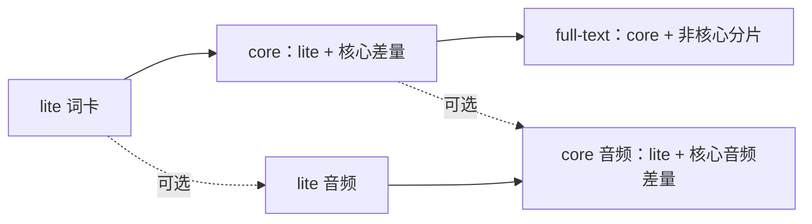

# 0.0.3 词包与接入

0.0.3 使用 `leximeet.release.v3`，先交付五种组合。`full-audio` 的全词离线音频安排在 1.0.0，当前不能选用。正式下载量、词量和文件哈希以对应 Release 的 `release.json` 为准。

## 选择组合

| 组合 | 词卡范围 | 离线录音 |
| --- | --- | --- |
| `lite-text` | 从核心词中精选；入选词保留完整词卡、词书归属和已有助记 | 无 |
| `lite-audio` | 与 lite-text 相同 | 每个 lite 词都有 |
| `core-text` | 全部 117,902 个核心词，包括全部 open-dictionary 词卡 | 无 |
| `core-audio` | 与 core-text 相同 | 每个核心词都有 |
| `full-text` | 全部 811,092 个词，核心词沿用学习层，非核心词保留已有基础内容 | 无 |

`text` 表示不下载离线录音；中文、音标、例句和学习内容不会因此删减。消费端仍可自行接入在线朗读。新版 full-text 不默认附带核心录音；需要核心词朗读时可复用另行下载的 core 音频，不能把它称作“全词有声版”。

## lite 如何选词

两种 lite 组合的完整下载量必须各自严格小于 **100,000,000 字节**，包括清单、来源与许可文件；安装后的 SQLite 和缓存不受此下载上限约束。

1. 纳入现有 23 个考试／专业目录的全部成员，不截断学习词书。
2. 纳入固定的 34 个高频功能词。与词书去重后，必选集合为 22,356 词。
3. 其余核心词按 ECDICT `frq` 排序，无 frq 时用 `bnc`，无两者时排在末尾；同级依次按 `lookup_key`、`entry_id` 排序。这是固定历史词频，不声称代表当前语料。
4. 对候选前缀实际压缩词卡并重建音频索引，逐步补入能容纳的词。为清单和选词报告预留 64 KiB，再由最终清单核对真实总量。

每个入选词的释义、例句、原始标签、词书数据和已有助记完整保留。必选集合超出预算时构建失败，不能静默删词或删字段。名单、规则、数量和排序后的 ID 摘要写入 `selection.json`，词卡资产本身就是确切名单。当前版本不保证 lite 包含全部 open-dictionary 词；需要全部主词卡时选择 core。

## 一份词典如何供五种组合使用



| 层 | 文件 | 作用 |
| --- | --- | --- |
| lite 词卡 | `entries-lite.jsonl.zst` | 五种组合共用 |
| core 词卡差量 | `entries-core-delta.jsonl.zst` | 只含其余核心词 |
| full 词卡差量 | `entries-full-delta-*.jsonl.zst` | 只含非核心词，按未压缩字节量均衡分片 |
| lite 音频 | `audio-lite.index.jsonl.zst`、`audio-lite-*.pack` | 只含 lite 词的录音 |
| core 音频差量 | `audio-core-delta.index.jsonl.zst`、`audio-core-delta-*.pack` | 只含其余核心词的录音 |

JSONL 使用固定的 Zstandard 9 级压缩。每片能独立解压和校验，不能把多个文件当成一个 gzip 文件拼接。`.pack` 保留原始 Ogg 音频：合成录音使用 Opus，真人录音保留原始编码；索引中的 `shard`、`offset`、`bytes`、`sha256` 定位单词录音，无需解压整片。所有发布文件不超过 256 MiB。

不再同时下载完整词卡和重复的学习 SQLite。消费端流式导入 JSONL，在本地建立索引；随包 `catalogs.json` 提供目录名称和来源，词卡里的 `learning.collections`、`mnemonics` 提供成员和学习内容。0.0.3 为成员补充可选 `match_method` 字段，其余核心词卡沿用 `leximeet.entry.v2`。完整字段见[词条结构](WORD_ENTRY_MODEL.md)。

## 下载与升级协议

1. 从**固定版本**获取 `release.json`，检查协议版本和目标组合；不要沿用旧版 `editions.core`。
2. 读取 `editions[组合名].assets`。每个文件的大小和 SHA-256 在 `assets` 中；`download_bytes` 包含清单自身，`manifest_bytes` 是清单的精确大小。
3. 按哈希复用已有文件。缺失或校验失败的文件独立下载和重试；一个文件失败不需要重新下载其他成功文件。
4. 全部校验通过后流式建索引，核对词量、目录及音频引用，再原子切换安装指针。失败时保留旧词包。

| 升级 | 新增下载 |
| --- | --- |
| lite-text → lite-audio | lite 音频及音频来源文件 |
| lite-text → core-text | core 词卡差量 |
| lite-audio → core-audio | core 词卡差量和核心音频差量 |
| core-text → core-audio | 两层核心音频及音频来源文件 |
| core → full-text | 非核心词卡分片 |

core-audio → full-text 时已下载的录音可以继续留在缓存中，但 full-text 自身是无声组合。发布协议不做单文件的二进制补丁；跨版本只复用哈希相同的文件。0.0.2 的核心音频整包已在新版中重新分层，通常不能整文件复用。

用户单词本、笔记、学习进度和自定义标签应放在公共词包之外。已安装的公共资产必须只读；参考安装器在同一磁盘上用硬链接复用缓存，避免为每次安装复制一份录音。

## 参考命令

需要 Python 3.11+。以下以已经发布的 v0.0.3 为前提；发版前可以用本地构建目录和 `--source` 运行相同安装流程。

```bash
python3 -m venv .venv
source .venv/bin/activate
python -m pip install -r requirements.txt
mkdir -p downloads/v0.0.3
curl -fL https://github.com/leximeet/leximeet-dictionary/releases/download/v0.0.3/release.json \
  -o downloads/v0.0.3/release.json

# 缓存保留已经核验的分片。升级时改 edition，继续使用同一缓存。
python -m leximeet_dictionary package-plan downloads/v0.0.3 \
  --edition lite-audio --cache build/package-cache
python -m leximeet_dictionary package-install downloads/v0.0.3 \
  --edition lite-audio --cache build/package-cache --out build/dictionary-install \
  --url https://github.com/leximeet/leximeet-dictionary/releases/download/v0.0.3
```

安装命令返回 `package_path`；`current.json` 记录当前安装的相对路径。其目录内的 `dictionary.sqlite` 支持既有 `lookup`、`learning-catalogs`、`learning-members`、`learning-entry` 命令。

```bash
python -m leximeet_dictionary lookup --db <package_path>/dictionary.sqlite photosynthesis
python -m leximeet_dictionary learning-catalogs --db <package_path>/dictionary.sqlite
python -m leximeet_dictionary learning-members --db <package_path>/dictionary.sqlite exam:ecdict:cet4
python -m leximeet_dictionary package-audio <package_path> --entry-id <entry_id> --out /tmp/word.ogg
```

消费端可在 SQLite、IndexedDB 或其他本地存储中实现同样协议，不需要把本仓库作为子模块，也不要求浏览器运行 Python。参考安装器演示流程，原生客户端自行实现下载、索引与播放。

0.0.1 完整 SQLite 中的独立 WordNet 候选库仍按[旧版协议](CLIENT_CONTRACT.md)读取；它没有并入 0.0.3 词卡。非核心词的学习内容和全词离线音频按[开发路线](ROADMAP.md)逐步补充。
