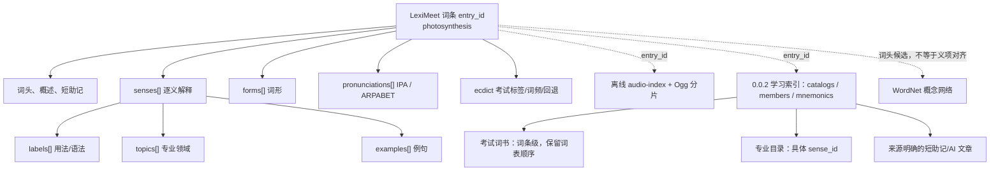

# 一个真实单词的完整结构：photosynthesis

本页的 JSONC 样本逐字段取自 **已发布的 0.0.1 核心版**，词头为 photosynthesis，词遇词条 ID 为 7fb01ea7-0fab-5cc5-8723-d902d6a16c99。只添加中文注释，值、数组顺序和空值保持原样；因此下方是供阅读的 JSONC，去掉注释即可作为普通 JSON。样本取自 dist/v0.0.1/core.entries.jsonl.gz。示例里 ecdict.zh_fallback 的反斜杠转义为源字符串原值。

一个单词的“词卡”“读音文件”“词书归属”“助记文章”“WordNet 概念”不是同一个 JSON 对象。这样能分别更新来源，而不重写基础释义。

## 整体关系图



## 0.0.1 原样词卡（逐字段中文注释）

所有数组都展示完整：本词有 1 个义项、1 个词形、5 条候选音标和 2 个 ECDICT 考试标签。注释解释字段语义，不代表新增字段。

```jsonc
{
  // 0.0.1 词卡中的预留数组；离线录音实际由独立 audio-index 按 entry_id 关联。
  "audio_ids": [],
  // 主词卡和同版审计记录的义项结构是否对齐。
  "audit_status": "aligned",
  // 学习词卡的主要释义语言。
  "definition_language": "zh-Hans",
  // ECDICT 提供的词条级补充；不等于每个义项的精确翻译。
  "ecdict": {
    // ECDICT 英文回退释义；与主词卡义项分开。
    "en_fallback": "n. synthesis of compounds with the aid of radiant energy (especially in plants)",
    // ECDICT 词条级考试标签；可派生备考集合。
    "exam_tags": [
      {
        // 源标签或领域代码；必须结合外层对象判断它是考试、用法还是领域。
        "code": "toefl",
        // 作用域：entry 是整词条；sense 是某个具体意思。
        "scope": "entry",
        // 该字段的来源标识，避免不同词典混淆。
        "source": "ecdict:bc015ed2",
        // 来源断言的状态，不等于人工核实。
        "status": "source-asserted"
      },
      {
        // 源标签或领域代码；必须结合外层对象判断它是考试、用法还是领域。
        "code": "gre",
        // 作用域：entry 是整词条；sense 是某个具体意思。
        "scope": "entry",
        // 该字段的来源标识，避免不同词典混淆。
        "source": "ecdict:bc015ed2",
        // 来源断言的状态，不等于人工核实。
        "status": "source-asserted"
      }
    ],
    // ECDICT 的历史频率名次；越小通常越靠前，不当作 CEFR 等级。
    "frequency_ranks": {
      // ECDICT 中 BNC 频率名次。
      "bnc": 17561,
      // ECDICT 中 frq 频率名次。
      "frq": 17755
    },
    // ECDICT 的旧式音标文本，不冒充 IPA。
    "legacy_phonetic": ".fәutәu'sinθәsis",
    // ECDICT 的其他原始字段；本词没有。
    "source_fields": {},
    // ECDICT 原始词条级中文回退文本；字符串里的转义换行按原始值保留。
    "zh_fallback": "n. 光合作用\\n[化] 光合作用"
  },
  // 词遇稳定词条 ID；关联音频、目录、助记的主键。
  "entry_id": "7fb01ea7-0fab-5cc5-8723-d902d6a16c99",
  // 词形变化；不等于新的词条。
  "forms": [
    {
      // 该字段的来源标识，避免不同词典混淆。
      "source": "open-dictionary:v2.0",
      // 词形或发音的来源标签。
      "tags": [
        "plural"
      ],
      // 词形文本、音标文本或例句英文，含义取决于外层对象。
      "text": "photosyntheses"
    }
  ],
  // 查询及展示的词头。
  "headword": "photosynthesis",
  // 词头语言。
  "headword_language": "en",
  // 主词库的整词概述，不代替各义项。
  "headword_summary_zh": "光合作用：植物和其他能利用光能的生物把光能转化为化学能，并通常用来合成有机物的过程。",
  // Unicode NFC 与大小写折叠后的查询键；不用于合并大小写不同的词条。
  "lookup_key": "photosynthesis",
  // 当前主词卡已有的简短中文助记。
  "memory_hook_zh": "把植物想成一座靠阳光供电的工厂：它先接收光能，再把这种能量“存”进化学物质中，于是光能转成化学能，这整个过程就是光合作用。",
  // curated 表示来自主词卡；ecdict-fallback 表示缺词回退。
  "origin": "curated",
  // 候选读音列表；IPA 与 ARPABET 记法不同。
  "pronunciations": [
    {
      // 同一来源的词源组 ID；null 表示没有绑定。
      "etymology_id": "et1",
      // 音标记法：IPA 或 CMUdict 的 ARPABET。
      "notation": "IPA",
      // 词性；发音记录中 null 表示未限词性。
      "pos": "noun",
      // 读音对应的地区或口音。
      "region": "en-US",
      // 该字段的来源标识，避免不同词典混淆。
      "source": "open-dictionary:v2.0",
      // 词形或发音的来源标签。
      "tags": [
        "US"
      ],
      // 词形文本、音标文本或例句英文，含义取决于外层对象。
      "text": "/ˌfoʊ.toʊˈsɪn.θə.sɪs/"
    },
    {
      // 同一来源的词源组 ID；null 表示没有绑定。
      "etymology_id": "et1",
      // 音标记法：IPA 或 CMUdict 的 ARPABET。
      "notation": "IPA",
      // 词性；发音记录中 null 表示未限词性。
      "pos": "noun",
      // 读音对应的地区或口音。
      "region": "en-GB",
      // 该字段的来源标识，避免不同词典混淆。
      "source": "open-dictionary:v2.0",
      // 词形或发音的来源标签。
      "tags": [
        "UK"
      ],
      // 词形文本、音标文本或例句英文，含义取决于外层对象。
      "text": "/ˌfəʊ.təʊˈsɪn.θə.sɪs/"
    },
    {
      // 同一来源的词源组 ID；null 表示没有绑定。
      "etymology_id": "et1",
      // 音标记法：IPA 或 CMUdict 的 ARPABET。
      "notation": "IPA",
      // 词性；发音记录中 null 表示未限词性。
      "pos": "noun",
      // 读音对应的地区或口音。
      "region": "en-GB",
      // 该字段的来源标识，避免不同词典混淆。
      "source": "open-dictionary:v2.0:audit:wiktionary:2025-10-23",
      // 词形或发音的来源标签。
      "tags": [
        "UK"
      ],
      // 词形文本、音标文本或例句英文，含义取决于外层对象。
      "text": "[ˌfəʊ.tʰəʊˈsɪn̪.θə.sɪs]"
    },
    {
      // 同一来源的词源组 ID；null 表示没有绑定。
      "etymology_id": "et1",
      // 音标记法：IPA 或 CMUdict 的 ARPABET。
      "notation": "IPA",
      // 词性；发音记录中 null 表示未限词性。
      "pos": "noun",
      // 读音对应的地区或口音。
      "region": "en-US",
      // 该字段的来源标识，避免不同词典混淆。
      "source": "open-dictionary:v2.0:audit:wiktionary:2025-10-23",
      // 词形或发音的来源标签。
      "tags": [
        "US"
      ],
      // 词形文本、音标文本或例句英文，含义取决于外层对象。
      "text": "[ˌfŏʊ.ɾoʊˈsɪn̪.θə.sɪs]"
    },
    {
      // 同一来源的词源组 ID；null 表示没有绑定。
      "etymology_id": null,
      // 音标记法：IPA 或 CMUdict 的 ARPABET。
      "notation": "ARPABET",
      // 词性；发音记录中 null 表示未限词性。
      "pos": null,
      // 读音对应的地区或口音。
      "region": "en-US",
      // 该字段的来源标识，避免不同词典混淆。
      "source": "cmudict:74790861",
      // 词形或发音的来源标签。
      "tags": [],
      // 词形文本、音标文本或例句英文，含义取决于外层对象。
      "text": "F OW2 T OW0 S IH1 N TH AH0 S IH0 S"
    }
  ],
  // 本条 JSON 的结构版本，不等于词典数据发布版本。
  "schema_version": "leximeet.entry.v1",
  // 逐义词卡数组；专业领域应关联到这里。
  "senses": [
    {
      // 界面显示顺序，不能用数组位置代替。
      "display_order": 0,
      // 来源审计补入的英语义项解释。
      "english_gloss": "Any process by which plants and other photoautotrophs convert light energy into chemical energy.",
      // 英语义项解释的具体审计来源。
      "english_gloss_source": "open-dictionary:v2.0:audit:wiktionary:2025-10-23",
      // 同一来源的词源组 ID；null 表示没有绑定。
      "etymology_id": "et1",
      // 这个义项的例句列表。
      "examples": [
        {
          // 该字段的来源标识，避免不同词典混淆。
          "source": "open-dictionary:v2.0",
          // 词形文本、音标文本或例句英文，含义取决于外层对象。
          "text": "Plants use sunlight for photosynthesis.",
          // 例句中文翻译。
          "translation": "植物利用阳光进行光合作用。"
        },
        {
          // 该字段的来源标识，避免不同词典混淆。
          "source": "open-dictionary:v2.0",
          // 词形文本、音标文本或例句英文，含义取决于外层对象。
          "text": "Photosynthesis converts light energy into chemical energy.",
          // 例句中文翻译。
          "translation": "光合作用把光能转化为化学能。"
        }
      ],
      // 语法、语域、使用方式等义项标签。
      "labels": [
        {
          // 源标签或领域代码；必须结合外层对象判断它是考试、用法还是领域。
          "code": "uncountable",
          // 作用域：entry 是整词条；sense 是某个具体意思。
          "scope": "sense",
          // 该字段的来源标识，避免不同词典混淆。
          "source": "open-dictionary:v2.0"
        },
        {
          // 源标签或领域代码；必须结合外层对象判断它是考试、用法还是领域。
          "code": "usually",
          // 作用域：entry 是整词条；sense 是某个具体意思。
          "scope": "sense",
          // 该字段的来源标识，避免不同词典混淆。
          "source": "open-dictionary:v2.0"
        }
      ],
      // 学习者向的中文长解释。
      "learner_explanation_zh": "植物和其他能利用光能的生物把光能转化为化学能的过程。可以把它想成植物用阳光给自己“充能”，并把能量存进有机物中。",
      // 词性；发音记录中 null 表示未限词性。
      "pos": "noun",
      // 主词库设置的义项展示优先级。
      "priority": "core",
      // 词遇稳定义项 ID；专业目录用它突出正确意思。
      "sense_id": "b9ceed6e-5efd-568b-84a8-f6325da61a6f",
      // 供词卡标题使用的简短中文义项。
      "short_gloss": "光能转化为化学能的过程",
      // 回溯主词库原始词条、词性组和义项位置。
      "source_ref": {
        // 词遇稳定词条 ID；关联音频、目录、助记的主键。
        "entry_id": "9df0e7f2-2ce3-57c8-b649-1374219fefa9",
        // 同一来源的词源组 ID；null 表示没有绑定。
        "etymology_id": "et1",
        // 上游词性组的序号。
        "group_index": 0,
        // 词性；发音记录中 null 表示未限词性。
        "pos": "noun",
        // 词遇稳定义项 ID；专业目录用它突出正确意思。
        "sense_id": "s1",
        // 该字段的来源标识，避免不同词典混淆。
        "source": "open-dictionary:v2.0"
      },
      // 这个义项的专业/主题领域代码。
      "topics": [
        {
          // 源标签或领域代码；必须结合外层对象判断它是考试、用法还是领域。
          "code": "biochemistry",
          // 作用域：entry 是整词条；sense 是某个具体意思。
          "scope": "sense",
          // 该字段的来源标识，避免不同词典混淆。
          "source": "open-dictionary:v2.0"
        },
        {
          // 源标签或领域代码；必须结合外层对象判断它是考试、用法还是领域。
          "code": "biology",
          // 作用域：entry 是整词条；sense 是某个具体意思。
          "scope": "sense",
          // 该字段的来源标识，避免不同词典混淆。
          "source": "open-dictionary:v2.0"
        },
        {
          // 源标签或领域代码；必须结合外层对象判断它是考试、用法还是领域。
          "code": "chemistry",
          // 作用域：entry 是整词条；sense 是某个具体意思。
          "scope": "sense",
          // 该字段的来源标识，避免不同词典混淆。
          "source": "open-dictionary:v2.0"
        },
        {
          // 源标签或领域代码；必须结合外层对象判断它是考试、用法还是领域。
          "code": "microbiology",
          // 作用域：entry 是整词条；sense 是某个具体意思。
          "scope": "sense",
          // 该字段的来源标识，避免不同词典混淆。
          "source": "open-dictionary:v2.0"
        },
        {
          // 源标签或领域代码；必须结合外层对象判断它是考试、用法还是领域。
          "code": "natural-sciences",
          // 作用域：entry 是整词条；sense 是某个具体意思。
          "scope": "sense",
          // 该字段的来源标识，避免不同词典混淆。
          "source": "open-dictionary:v2.0"
        },
        {
          // 源标签或领域代码；必须结合外层对象判断它是考试、用法还是领域。
          "code": "organic-chemistry",
          // 作用域：entry 是整词条；sense 是某个具体意思。
          "scope": "sense",
          // 该字段的来源标识，避免不同词典混淆。
          "source": "open-dictionary:v2.0"
        },
        {
          // 源标签或领域代码；必须结合外层对象判断它是考试、用法还是领域。
          "code": "physical-sciences",
          // 作用域：entry 是整词条；sense 是某个具体意思。
          "scope": "sense",
          // 该字段的来源标识，避免不同词典混淆。
          "source": "open-dictionary:v2.0"
        }
      ],
      // 该义项的中文使用提醒。
      "usage_note_zh": "常用“植物进行光合作用”“通过光合作用制造……”“光合作用需要……”。它通常指一个过程，作不可数名词使用，不要随意加复数词尾。说明具体机制时，常把光、水、二氧化碳、氧气或糖放在它前后作搭配。"
    }
  ],
  // 主词库的原始词条 ID；与词遇 entry_id 不同。
  "source_entry_id": "9df0e7f2-2ce3-57c8-b649-1374219fefa9",
  // 主词卡已有的学习提示列表。
  "study_notes_zh": [
    "先记住“阳光驱动的能量储存”这一核心画面，再补充二氧化碳、水、糖和氧气等具体内容。不要把光合作用误解成植物的“呼吸”；呼吸作用是另一种能量过程。"
  ]
}
```

## 词卡之外还有什么

0.0.1 的离线音频不写在本条 JSON 中。其 audio-index 对同一 entry_id 给出 shard=audio-core-0001.pack、offset=37051194、bytes=2829、format=audio/ogg、kind=synthetic、style=headword、source_ref=espeak-ng/en-us，字节 SHA-256 为 fb50ab51975487ec93134f73f6041011cd40e06044048f357edd26debad042da。客户端在分片读取 [offset, offset + bytes) 即得独立 Ogg。词卡里的 audio_ids=[] 不代表没有离线录音。

WordNet 也单独保存。本词按词头查询得到候选 synset 13558632-n，definition 为 synthesis of compounds with the aid of radiant energy (especially in plants)，mapping_status=unmapped-headword-candidate。它尚未自动绑定上面的 sense_id，不能把 WordNet 定义冒充经过对齐的主词义。

0.0.2 本地试产学习索引还能查询到本词的 ECDICT 托福/GRE 集合、qwerty 托福/GRE 候选词书、义项级生物目录，以及原有短助记。qwerty 候选的权利状态和 0.0.1 正式词包不同；详见 [设计文档](DESIGN_0.0.2.md)。本词在 DictionaryByGPT4 当前固定输入中没有匹配文章。

## 与上游 JSON 的区别

| 能力 | open-dictionary v2.0 | ECDICT CSV | LexiMeet 当前与 0.0.2 方向 |
| --- | --- | --- | --- |
| 词义 | 策展的逐义学习词卡 | 词条级中/英释义列 | 保留逐义词卡，ECDICT 明确标记为回退；不把整词翻译伪装成逐义翻译 |
| 领域/用法 | 义项 topics、labels | tag 主要是考试分类 | 保存原作用域；0.0.2 从 sense_id 生成专业目录 |
| 词书 | 无中国备考教材顺序 | exam tag 可派生考试集合 | 0.0.2 引入独立词书目录、成员顺序和来源 |
| 助记 | memory_hook 与 study_notes | 无结构化助记 | 0.0.2 独立存短助记与长篇候选，标出复核状态 |
| 发音 | IPA 和音频线索 | 旧式音标 | IPA、CMU ARPABET、离线音频索引分别保存 |
| 交付 | 上游数据文件 | CSV | 0.0.1 可校验 core/full 资产；0.0.2 计划加入核心学习索引 |

## kajweb/dict 能力映射与 0.0.3

实查本地参考仓库的 **81 个 ZIP、153,009 条记录**，顶层字段均为 `wordRank/headWord/content/bookId`；内层 `content.word.content` 共出现 17 类字段，不是每个词都有全部字段。CET4_3 的首词 cancel 含完整的四选一题、例句、近义词、短语、同根词和双语翻译；它的 `remMethod` 等字段可能只在其他词出现。下表是字段能力映射，不复制无许可内容。

| 参考字段及内部结构 | 词遇已有或规划的落点 |
| --- | --- |
| `bookId/wordRank/content.word.wordId` | 0.0.2 `catalogs/members` 的目录、顺序与来源映射 |
| `headWord/content.word.wordHead` | 现有 `headword`；核对两处拼写一致 |
| `content.word.content.trans[].tranCn/tranOther/pos` 及 `descCn/descOther` | 现有逐义解释和 ECDICT 回退；说明性 `desc` 不直接当词义 |
| `usphone/ukphone/phone` | 现有 `pronunciations[]`；原始旧式音标不冒充 IPA |
| `usspeech/ukspeech/speech` | 独立音频索引；不复用有道请求参数或第三方音频 |
| `sentence.sentences[].sContent/sCn` | 现有 `senses[].examples[]`；新增例句需能对齐义项和来源 |
| `remMethod.val/desc` | 现有短助记与 0.0.2 `mnemonics`；AI 内容保存生成/复核元数据 |
| `syno.synos[].pos/tran/hwds[].w` | 0.0.3 的近义关系，保留词性和所指义项 |
| `antos.anto[].hwd` | 0.0.3 的反义关系，不靠词头机械推断 |
| `phrase.phrases[].pContent/pCn` | 0.0.3 的短语/搭配层 |
| `relWord.rels[].pos/words[].hwd/tran` | 0.0.3 的派生词关系，保留词性与中文说明 |
| `exam[].question/choices/answer/examType` | 0.0.3 的练习题；记录题型、选项、答案、解析与生成来源 |
| `realExamSentence.sentences[].sourceInfo` | 只有可核查的来源/使用依据才能标为真题；AI 产出只能叫模拟练习 |
| `star` | 原字段含义尚未核实，不能直接变成词频/难度；如需等级另定量表 |
| `picture` | 0.0.3 可设计配图层，但需自有/明确授权图片和替代文本 |

[kajweb/dict](https://github.com/kajweb/dict) 当前仓库未见许可证，README 自述数据采自词典 App；因此 0.0.3 的目标是用有依据的词遇词卡和 AI 生产**自己的**内容来覆盖这些能力；`realExamSentence`、原始图片与原始音频不能仅靠 AI 伪造来源。经 qwerty-learner 加工并不自动使上游数据获得再分发授权，具体发布边界见 [0.0.2 设计](DESIGN_0.0.2.md)。
